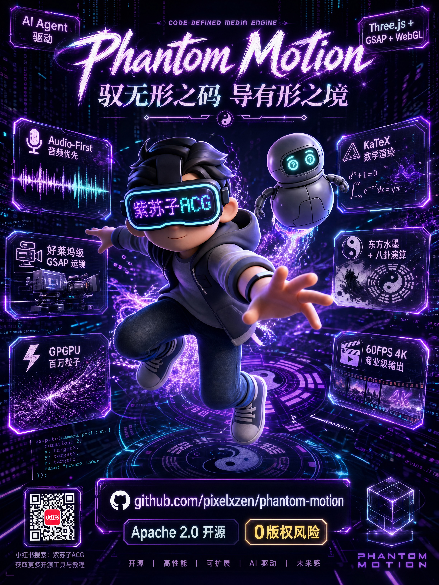
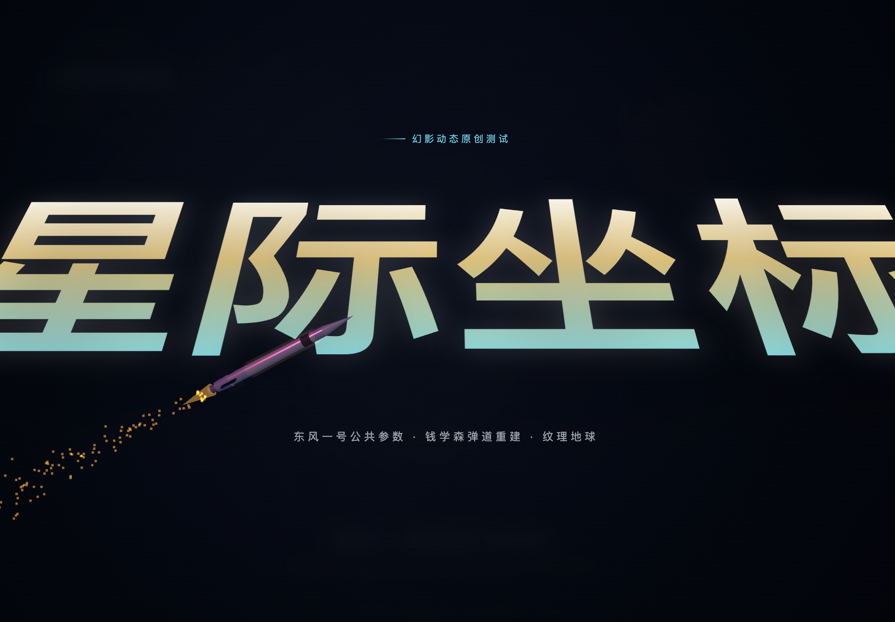

<div align="center">
  
  
  <h3>Code-Defined Media Engine</h3>

  <p>
    <b>Phantom Motion</b> is an extremely hardcore interactive motion graphic generator.<br>
    It goes beyond generating code; it integrates <b>Hollywood-grade GSAP cinematic camera rigs</b>, <b>GPGPU million-particle physics</b>, <b>KaTeX top-tier math rendering</b>, and <b>Oriental philosophy computation</b> into a next-gen HTML5/WebGL animation engine. Coupled with Hyperframes and headless browsers, it compresses AI-generated pure text scripts into <b>60FPS, 4K resolution, microsecond-synced commercial MP4 blockbusters</b> without any stutter.
  </p>

  <p>
    <a href="./README.md">🇨🇳 简体中文</a> | <a href="./README_EN.md">🇺🇸 English Version</a>
  </p>

  <p>
    
    
    
    
    
  </p>
</div>

<div align="center">
  
</div>

---

## 🌟 Why Does It Outperform Traditional Film Industry Workflows?

Code animations on the market are often "stiff element translations" with "highly robotic narration." **Phantom Motion** was born to end this by combining directorial restraint with graphics perfection in an AI agent:

- **🎙️ Audio-First Engine**: Generates sound before drawing visuals. Utilizes TTS to obtain an absolute timeline, enabling GSAP `Duck & Swell` (BGM automatically yielding to vocals) for microsecond audio-visual synchronization.
- **🎥 Script-Driven Cinematic Camera Rig**: Strictly prohibits random camera flying! Built-in classic cinematic camera movements. The LLM schedules the 3D camera precisely using GSAP tracking proxy technology based on script emotion.
- **🏛️ 3D Heritage & Hologram Engine**: Directly supports GLTF/GLB high-poly PBR model loading and one-click switching to `Hologram Mode` (purple glowing mesh perspective), perfectly deducing the collision of cultural heritage and modern technology.
- **📊 Advanced Data Visualization Engine**: Discards frame-dropping chart libraries, using `D3.js + GSAP` to map real data into high-end smooth curves (Spline) with dynamic growth animations synchronized with narration.
- **🚫 0 Copyright & Legal Risks**: All core effects are composed of native WebGL, Three.js Shaders, and open-source libraries. Refusing any closed-source paid plugins, the generated MP4 videos belong 100% to the creators.

---

## 📂 Repository Structure

```text
phantom-motion/
├── assets/                 # Public media assets (e.g., donation QR code, logo)
├── references/             # Core component library (Three.js snippets, GSAP rigs, etc.)
├── scripts/                # Core engine scripts (TTS generation, BGM generation, HTML assembly)
├── tests/                  
│   └── xingji/             # "Qian Xuesen Trajectory" complete animation example & static assets
├── SKILL.md                # Core agent logic system instruction library (System Prompt V6.0)
├── logo.svg                # Dynamic SVG Logo
├── README.md               # Chinese Documentation
└── README_EN.md            # English Documentation
```

---

## 🚀 Quickstart

Phantom Motion is designed as an extremely elegant CLI agent Skill. It can be mounted on current mainstream edge or cloud code agents:

1. **Environment Preparation**
   Ensure Node.js and Python3 are installed, then execute in this project directory:
   ```bash
   npm install
   pip install requests
   ```

2. **Install to Agent**
   You can configure this repository as a core Skill or Workspace for the following AI IDEs:
   - **Claude Code**: Load this directory directly as an independent Workspace, or map `SKILL.md` via custom Skill commands.
   - **Codex / Openclaw / Hermes / Antigravity**: Register the contents of `SKILL.md` into your custom Agent Prompt library and allow the agent to read the `scripts/` and `references/` directories.

3. **Awaken the Agent**
   Type the trigger word in your terminal or dialogue box:
   > *"Help me generate a code animation about quantum mechanics"*

4. **Fully Automated Generation**
   The AI automatically breaks down the script -> Researches data -> Generates TTS & BGM -> Assembles HTML skeleton -> Mounts effect code -> Final synthesis.

---

## ⚠️ Top LLMs & API Key Desensitization Warning

> **【Model Recommendation】** 
> Good code animation requires iterative refinement to achieve premium results! Don't expect to get a masterpiece with a single sentence. Premium works require repeated storyboard polishing and code iteration with AI.
> Therefore, **we strongly recommend using top-tier models**: `Claude Opus 4.7+`, `Gemini 3.1+ Pro`, `ChatGPT 5.5+`. Only their massive context and coding logic can handle this level of visual narrative.

> **【API Key Statement】**
> The audio pipeline of this project (Gemini 3.1 Flash TTS, MiniMax Music API) requires users to configure their own API Key and Group ID environment variables.
> **Absolutely DO NOT sync code containing your personal API Keys to public repositories like GitHub!** After generating demo files, be sure to desensitize them!

---

## 🎬 Showcase: Masterpiece Prompts

If you want to experience the extreme power of the V6.0 engine, directly copy the following 5 **"God-level Director Prompts"** to your agent:

<details>
<summary><b>♟️ Script 01: "God's Move" (30s · Fast-paced & Epic)</b></summary>

> "Create a 30-second high-energy short film recreating AlphaGo vs. Lee Sedol's Game 4 'God's Move (Move 78)' in 2016.
> **[0-3s] Intro**: Pure black background, oppressive white giant text 'God's Move' smashing down with heavy bass, faint code glitching in the background.
> **[3-27s] Board & Moves**: Search the real coordinates of the game online. Call [SVG Oriental Chess Engine], on a minimalist wood-grain purple mesh, reproduce the absolute shock of move 78. No extra 3D rotation, camera stays at [Absolute Top-down Static]. Black and white pieces smash onto the board with strong rebound damping (back.out) synced with narration.
> **Narration**: Gemini Charon (deep male). Max 15 chars per line. 'The lonely city of human wisdom... crumbling before silicon computation... until that incredible 78th move.' BGM explodes with the move.
> **[Last 3s] Outro**: Board linearly fades to black, Phantom Motion LOGO emerges."
</details>

<details>
<summary><b>🏛️ Script 02: "Mortise & Tenon: Soul of Wood" (45s · Internal Perspective)</b></summary>

> "Create a 45s 3D deconstruction animation about Chinese ancient architecture heritage 'Mortise and Tenon'.
> **[0-3s] Intro**: Purple-gray background, large text 'Mortise & Tenon' emerges with crisp wood-knocking SFX.
> **[3-25s] Texture & Wisdom**: Research the real mechanical interlocking principle of 'Dovetail Joint'. Call [3D Artifact Engine (GLTFLoader)], import a highly realistic PBR wood texture mortise structure. Camera performs [Epic Orbit], showing seamless exterior.
> **[25-42s] Dimension Reduction Perspective**: When narration says 'No nails, yet withstands a thousand years of storm', wood PBR texture is instantly stripped, switching to [Hologram Mode]. Camera performs [Push-in], looking through the exquisite internal stress structure. Two wooden blocks disassemble and seamlessly assemble in mid-air.
> **Narration**: Gemini Erinome (intellectual female). Max 15 chars per line.
> **[Last 3s] Outro**: Holographic mesh dissipates into black."
</details>

<details>
<summary><b>📈 Script 03: "Tea and Empire" (60s · Macro Data Narrative)</b></summary>

> "Create a 60s data animation blockbuster of Silk Road tea trade history.
> **[0-3s] Intro**: Giant text 'Silk & Tea Road', ink particles dispersing from text edges.
> **[3-20s] History Scroll**: Call [3D Scroll Vertex Shader], smoothly unrolling a long scroll in the center. Use [Flying Ink Shader] to slowly permeate the Tang/Song dynasty trade map.
> **[20-57s] Data Flood**: Search real soaring data of Chinese tea exports to Europe from 17th-19th century. Absolutely NO ECharts! Must call [D3.js + GSAP Chart Engine], draw a highly aesthetic purple smooth spline above the 3D scroll. The line climbs with passionate symphony, with a semi-transparent glowing area shadow below.
> **Narration**: Male. 'A leaf... crossed ten thousand miles of ocean... dictated the rise and fall of empires.' Minimalist subtitles.
> **[Last 3s] Outro**: Line peaks into highlight, then linearly fades to black."
</details>

<details>
<summary><b>🪐 Script 04: "Sky Orbit: Qian Xuesen Trajectory" (90s · Hardcore Sci-Fi)</b></summary>

<div align="center">
  <a href="https://github.com/Pixelxzen/phantom-motion/blob/main/tests/xingji/output_1080p_16_9_SD.mp4">
    
  </a>
  <br>
  <p><i>(Official 1080P Landscape Render. Click the cover image above to go to the playback page and experience the epic texture of GPGPU particles and Charon's voice)</i></p>
</div>

> "Call max scientific computation, create a 90s hardcore popular science of Qian Xuesen trajectory (Boost-glide).
> **[0-3s] Intro**: Pure black background, large text 'Sky Orbit'.
> **[3-30s] History Archive**: Call [Archive Fetch Skill], download real copyright-free HD photos of Mr. Qian Xuesen from Wikipedia. Photos float in space as 3D glass holographic cards. Narration introduces his brilliant idea of gliding at the edge of the atmosphere.
> **[30-87s] Trajectory Calculation**: Trigger [GSAP Flip], holographic photos smoothly shrink to bottom left. High-precision PBR holographic mesh Earth emerges in center. **Mandatory**: Based on real physics, use CatmullRom Curve to draw a red glowing trajectory undulating like 'skipping stones' at the atmosphere edge, NEVER use a normal parabola! Camera closely follows the trajectory (Flyby).
> **Narration**: Female. 'At the edge of the atmosphere... gliding like skipping stones... rendering all defense systems useless.' Audio must have low-frequency enhancement.
> **[Last 3s] Outro**: Missile hits with a flash, fades to black."
</details>

<details>
<summary><b>☯️ Script 05: "Grand Unification: Quantum & Tao" (120s · Ultimate Visual Holy Grail)</b></summary>

> "Create a 120s top-tier philosophy & physics blockbuster exploring the ultimate resonance of Quantum Mechanics and Oriental 'I Ching'.
> **[0-3s] Intro**: Large text 'All Things, One Principle', with a deep Guqin sound.
> **[3-40s] Dance of Particles**: Trigger [1 Million GPGPU Particle Engine], full screen of microscopic glowing particles surging wildly in Curl Noise, showing the chaos and uncertainty of the quantum world. Center uses [KaTeX Math Engine] to surface the Schrödinger wave equation.
> **[40-80s] Formation Appears**: Narration: 'At the end of Western physics... Oriental philosophy has long been waiting.' Trigger physical field deformation, 1 million particles instantly converge into a perfect 3D Tai Chi symbol.
> **[80-117s] I Ching Deduction**: In the Tai Chi symbol, call [I Ching SVG Array Generator], Yin and Yang lines of the innate Bagua split and pop out layer by layer with heavy bass and strong damping. The entire Bagua array and background galaxy particles start a magnificent rotation.
> **Narration**: Deep male (Gravelly), minimalist words, epic breathing pauses. 'From the chaos of quantum entanglement... to the order of Yin and Yang... the universe shares the same origin.'
> **[Last 3s] Outro**: All particles extinguish like stars, returning to black. Trigger dual-state isolation code: render to MP4 and stop, web preview loops infinitely."
</details>

---

## 📈 Star History

[](https://star-history.com/#Pixelxzen/phantom-motion&Date)

---

## 🤝 Acknowledgements & License

This project was originally developed by **紫苏子ACG (Zisuzi ACG)**.
- **Phantom Motion Core Code**: Open-sourced under the [Apache-2.0 License](./LICENSE).
- **Font & Math Engine**: Based on MIT licensed [KaTeX](https://github.com/KaTeX/KaTeX) and [SplitType](https://github.com/lukePeeters/SplitType).
- **Graphics & Animation**: Powered by [Three.js](https://threejs.org/) and [GSAP](https://greensock.com/), partial data chart rendering supported by [D3.js](https://d3js.org/).
- **Headless Render Engine**: Special thanks to [Hyperframes](https://github.com/hyperframes/hyperframes) (Tech stack copyright belongs to the original authors).

The copyright of the final MP4 video products generated by the tool belongs to the users.

---

## ☕ Support & Contact

If you like this project, feel free to follow my social media or buy me a coffee!

<div align="center">
  <p>
    <a href="https://www.xiaohongshu.com/user/profile/5b80023bd72b6300011273e6"></a>
    
    
    <a href="https://x.com/Pixelxzen"></a>
  </p>
  
  <p><b>Scan to sponsor and support open source:</b></p>
  
</div>
